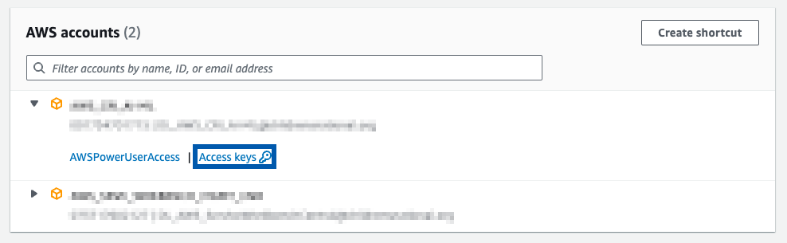
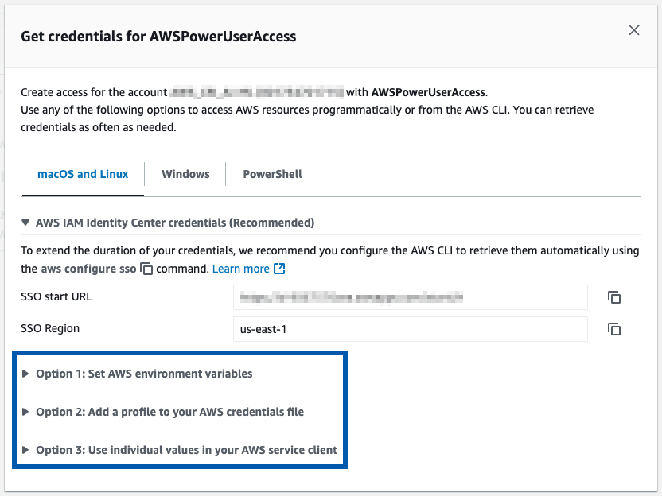

# AWS CLI
## Reference
- Installation: https://docs.aws.amazon.com/cli/latest/userguide/getting-started-install.html
- Configuration: https://docs.aws.amazon.com/cli/latest/userguide/cli-configure-sso.html

## Initial Configuration Steps
1. Download installer from the [link](https://docs.aws.amazon.com/cli/latest/userguide/getting-started-install.html).
2. Get information from `Access Keys` page:



3. Run configuration (`aws configure sso`) via terminal:
```zsh
% aws configure sso
SSO session name (Recommended): aws_cri
SSO start URL [None]: https://address_in_access_key_page.awsapps.com/start/#
SSO region [None]: us-east-1

Attempting to automatically open the SSO authorization page in your default browser.
If the browser does not open or you wish to use a different device to authorize this request, open the following URL:

https://device.sso.us-east-1.amazonaws.com/

Then enter the code:

####-####
There are 2 AWS accounts available to you.
Using the account ID ############
The only role available to you is: AWSPowerUserAccess
Using the role name "AWSPowerUserAccess"
CLI default client Region [None]: us-east-1
CLI default output format [None]: json
CLI profile name [AWSPowerUserAccess-############]: dkim1-profile

To use this profile, specify the profile name using --profile, as shown:

aws s3 ls --profile dkim1-profile
```  

4. Follow one of three instructions in `Access Keys` page:



## Log In and Out
### Log In
```zsh
% aws sso login --profile dkim1-profile
Attempting to automatically open the SSO authorization page in your default browser.
If the browser does not open or you wish to use a different device to authorize this request, open the following URL:

https://device.sso.us-east-1.amazonaws.com/

Then enter the code:

####-####
Successfully logged into Start URL: https://address_in_access_key_page.awsapps.com/start/#
```

### Log Out
```zsh
% aws sso logout
```

## EC2 Instance
Available commands list: https://docs.aws.amazon.com/cli/latest/reference/ec2/#cli-aws-ec2
### start-instances
Document: https://docs.aws.amazon.com/cli/latest/reference/ec2/start-instances.html
```zsh
% aws sso login --profile dkim1-profile
% aws ec2 start-instances --instance-ids i-1234567890abcdef0 --region us-east-1 --profile dkim1-profile
{
    "StartingInstances": [
        {
            "InstanceId": "i-1234567890abcdef0",
            "CurrentState": {
                "Code": 0,
                "Name": "pending"
            },
            "PreviousState": {
                "Code": 80,
                "Name": "stopped"
            }
        }
    ]
}
% aws sso logout
```

### stop-instances
Document: https://docs.aws.amazon.com/cli/latest/reference/ec2/stop-instances.html
```zsh
% aws sso login --profile dkim1-profile
% aws ec2 stop-instances --instance-ids i-1234567890abcdef0 --region us-east-1 --profile dkim1-profile
{
    "StoppingInstances": [
        {
            "InstanceId": "i-1234567890abcdef0",
            "CurrentState": {
                "Code": 64,
                "Name": "stopping"
            },
            "PreviousState": {
                "Code": 16,
                "Name": "running"
            }
        }
    ]
}
% aws sso logout
```
