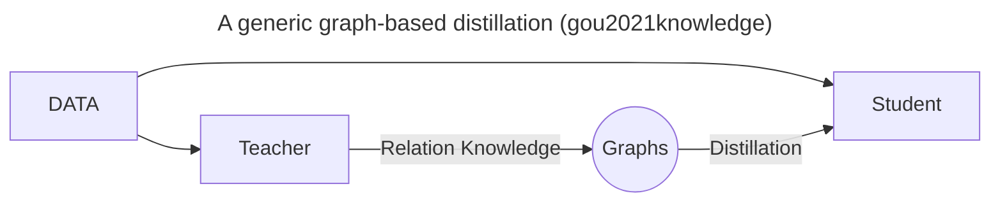
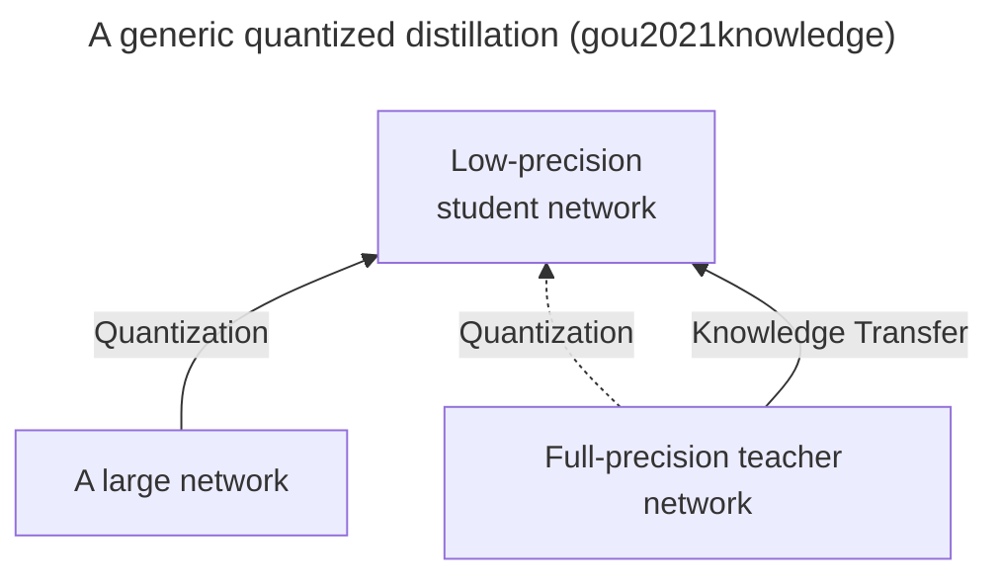

# Knowledge Distillation

## Definition
Methods that distill knowledge from larger deep neural netowkr model(s) to smaller model.

## Concepts
- Teacher-student architecture
- Knowledge
- Logits
- Dark knowledge
- Soft targets
- Hard targets
- Temperature
- Distillation loss
- Student-loss
- Distillation
    - Offline distillation
    - Online distillation
    - Self-distillation

## Graph-Based Distillation


Graphs are used for
- Carrier of teacher knowledge
- Controls the message passing of the teacher knowledge

## Quantized Distillation


## Reference
```bibtex
@article{hinton2015distilling,
  title={Distilling the knowledge in a neural network},
  author={Hinton, Geoffrey and Vinyals, Oriol and Dean, Jeff},
  journal={arXiv preprint arXiv:1503.02531},
  year={2015}
}

@article{gou2021knowledge,
  title={Knowledge distillation: A survey},
  author={Gou, Jianping and Yu, Baosheng and Maybank, Stephen J and Tao, Dacheng},
  journal={International Journal of Computer Vision},
  volume={129},
  number={6},
  pages={1789--1819},
  year={2021},
  publisher={Springer}
}
```